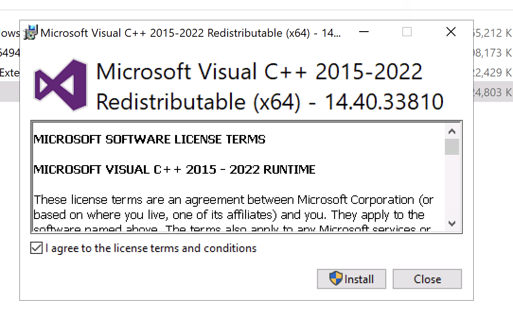
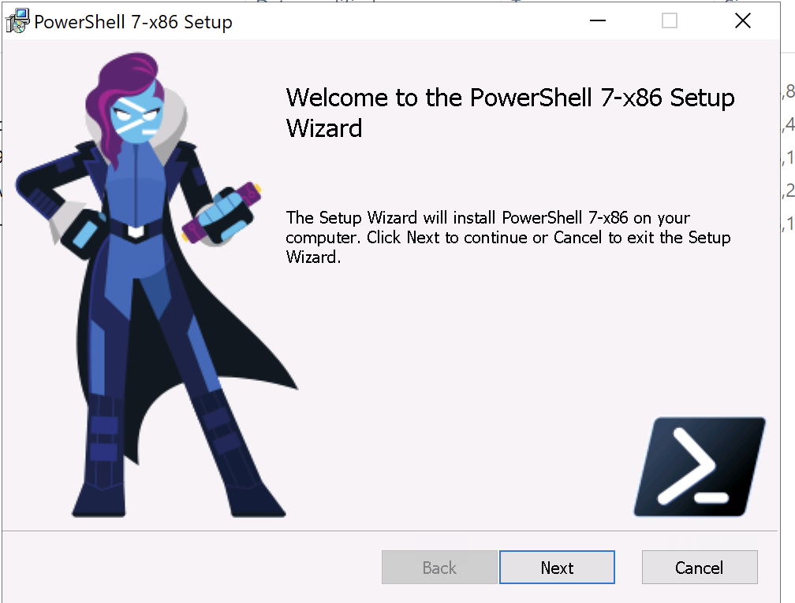
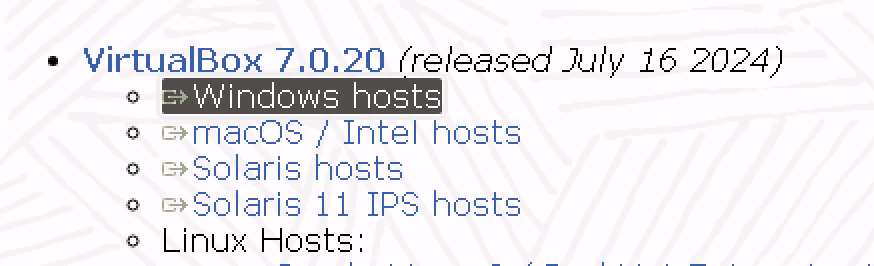
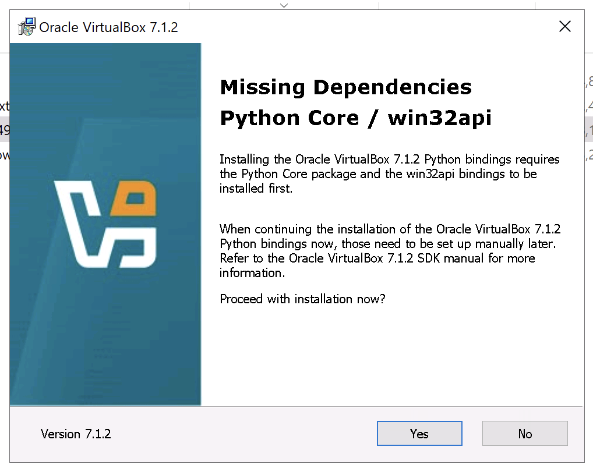

## Windows Setup Instructions

### Prerequisites

#### 1. Install Git

We'll use Git to download the workshop files. If you prefer not to install Git, you can download the files as a ZIP from GitHub.

[Download Git](https://git-scm.com/downloads)

#### 2. Install Visual Studio C++ Redistributable

This is needed to ensure all dependencies work correctly. Click the link below to download and install it:

[Download Visual Studio C++ Redistributable](https://aka.ms/vs/17/release/vc_redist.x64.exe)

<figure>

<figcaption
aria-hidden="true">Installing Visual C++ Redistributable.</figcaption>
</figure>

If you need a different version, check the [Microsoft Documentation](https://learn.microsoft.com/en-us/cpp/windows/latest-supported-vc-redist?view=msvc-170#latest-microsoft-visual-c-redistributable-version) for other options.

#### 3. Update PowerShell (Optional)

You can update to the latest version of PowerShell, but it's not required.

[Download PowerShell](https://aka.ms/PSWindows)

<figure>

<figcaption
aria-hidden="true">Update PowerShell to the latest release.</figcaption>
</figure>

### Install VirtualBox

VirtualBox is used to create and run virtual machines. We'll need version 7.0, as this is the latest compatible version with Vagrant. Follow the steps below to install it:

#### 1. Download and Install VirtualBox 7.0

[Download VirtualBox](https://download.virtualbox.org/virtualbox/7.0.20/VirtualBox-7.0.20-163906-Win.exe)

#### 2. Install the Extension Pack

This adds extra features to VirtualBox and can be installed after the main application.

[Download Extension Pack](https://download.virtualbox.org/virtualbox/7.0.20/Oracle_VM_VirtualBox_Extension_Pack-7.0.20.vbox-extpack)

<figure>

<figcaption
aria-hidden="true">Choose a version that is compatible with vagrant.</figcaption>
</figure>

#### 3. During Installation

- You may see an option for Python bindings. You can safely skip this by clicking "Yes" to proceed.

<figure>

<figcaption
aria-hidden="true">Proceed with installation, python is not needed here.</figcaption>
</figure>

### Install Vagrant

Vagrant will help us manage virtual machines with ease.

#### 1. Download Vagrant for Windows

[Download Vagrant](https://developer.hashicorp.com/vagrant/install#windows)

#### 2. Check the Installation

After installation, open a Command Prompt and run:

``` bash
vagrant version
```

You should see something like this:

``` sh
Installed Version: 2.4.1
Latest Version: 2.4.1

You're running an up-to-date version of Vagrant!
```

If you see an error saying that Vagrant is not found, try logging out and logging back in to your system. This is sometimes necessary for Windows to recognize new software.

## Alternative Setup Option

If you are already familiar with virtual machines and prefer to use a different toolchain (e.g., Parallels, VMware), you can skip the setup instructions above. In this case, prepare a virtual machine with **Ubuntu Linux 22.04 LTS** and ensure that **port 8080** is accessible on your host machine.

Next, install **Docker** and **Git** on the virtual machine. Once installed, run the following commands to set up the environment:

### 1. Install faasd

``` sh
curl -sfL https://raw.githubusercontent.com/openfaas/faasd/master/hack/install.sh | bash -s -
```

### 2. Install the OpenFaaS CLI

``` sh
curl -sSLf https://cli.openfaas.com | sh
```

### 3. Log in to OpenFaaS using the generated password

``` sh
cat /var/lib/faasd/secrets/basic-auth-password | /usr/local/bin/faas-cli login --password-stdin
```

This alternative approach allows you to use your preferred virtualization setup while still participating fully in the workshop.
